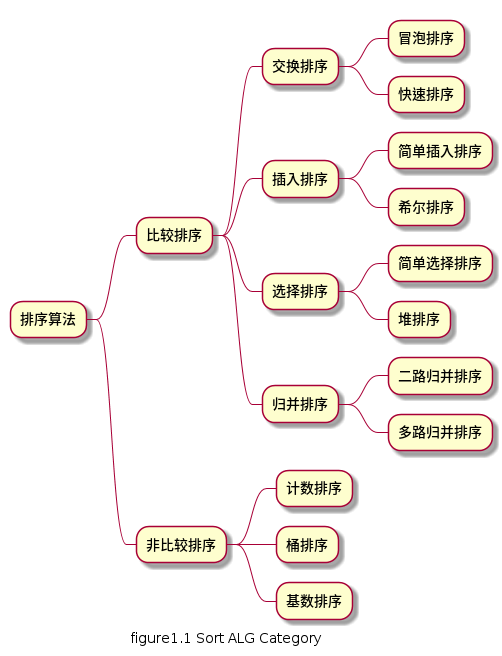

排序算法

排序算法大致可以分成以下两类:

* 比较类排序 - 通过比较来决定元素间的相对次序，由于其时间复杂度不能突破O(nlogn)，也称为非线性时间比较类排序
  * [冒泡排序](bubble_sort.md)
  * [快速排序](quick_sort.md)
  * [简单插入排序](insertion_sort.md)
  * 希尔排序
  * [简单选择排序](selection_sort.md)
  * 堆排序
  * [二路归并排序](merge_sort.md)
* 非比较类排序 - 不通过比较来决定元素间的相对次序，可以突破基于比较排序的时间下界，以线性时间运行，也称为线性时间非比较类排序
  * [计数排序](counting_sort.md)
  * 桶排序
  * 基数排序

排序算法演示网址: [VISUALGIO](https://visualgo.net/zh/sorting)

[十大经典排序算法](https://www.cnblogs.com/onepixel/articles/7674659.html)
